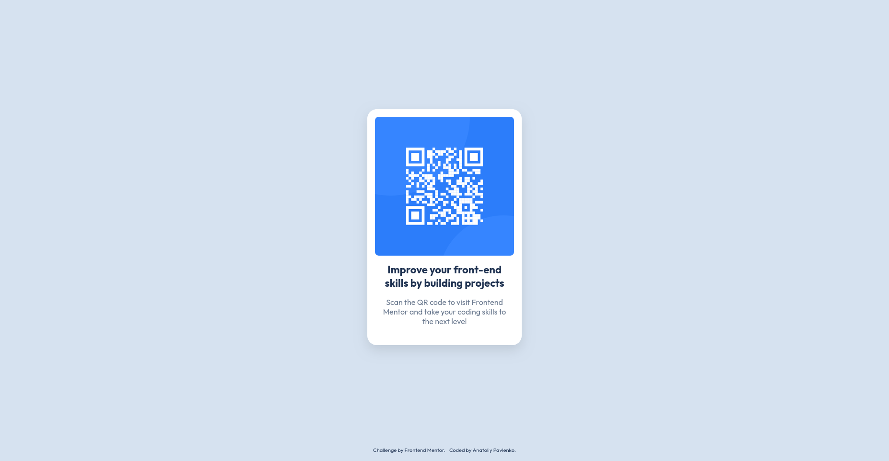

# Frontend Mentor - QR code component solution

This is a solution to the [QR code component challenge on Frontend Mentor](https://www.frontendmentor.io/challenges/qr-code-component-iux_sIO_H). Frontend Mentor challenges help you improve your coding skills by building realistic projects.

## Table of contents

- [Overview](#overview)
  - [Screenshot](#screenshot)
  - [Links](#links)
- [My process](#my-process)
  - [Built with](#built-with)
  - [What I learned](#what-i-learned)
  - [Continued development](#continued-development)
  - [Useful resources](#useful-resources)
  - [AI Collaboration](#ai-collaboration)
  - [Refactoring](#refactoring)
- [Author](#author)

## Overview

### Screenshot



### Links

- Solution URL: [QR code component](https://github.com/tolikhere/frontend-mentor/tree/main/newbie/QR-code-component)
- Live Site URL: [QR code component](https://tolikhere.github.io/frontend-mentor/newbie/QR-code-component/index.html)

## My process

### Built with

- Semantic HTML5 markup
- CSS custom properties
- Flexbox
- Nested selectors
- CSS custom variables

### What I learned

- Nested selector to organize CSS selectors.
- CSS variables to reduce repetition and errors.
- Center with absolute positioning and translate property.
- white-space property to prevent collapse of the content.

```css
.attribution {
  position: absolute;
  font-size: 0.6875rem;
  color: var(--slate-900);
  bottom: 0.4rem;
  left: 50%;
  translate: -50%;
  white-space: nowrap;

  a {
    text-decoration: none;
  }
}
```

Also I didn't use the Figma file, only design images.

### Continued development

Need to learn more ways to create a robust layout, so it won't collapse on different platforms. Choose the right property for creating width constrains and units. Work on position and font size units.

### Useful resources

- [MDN](https://developer.mozilla.org/en-US/) - Handy web site for web dev. I alway check out CSS properties and HTML tags, their examples with explanations here.

### AI Collaboration

After I finished with the project I used google AI to review my solution. But I didn't implement it, because I want to reflect on it, but not just copy. And I wanted to get AI review from Frontend Mentor to see a difference.

And yes it made a good point about my CSS styling at list e.g:

```css
.qr-img {
  width: 100%; /* Responsive scaling contained inside parent wrapper */
  display: block; /* Removes unwanted bottom baseline spacing gaps */
  border-radius: 10px;
}
```

So later I will make refactoring of my original solution with AI assistance.

The main point is I got the result without AI and I'm proud of it. Actually it help to learn even more.

### Refactoring

After I've got an AI review from Frontend Mentor I've made these changes:

- Made the text for the `alt` attribute more appropriate.
- Made the font size responsive by swap `px` units to `rem` units.
- Used the `min-width: 100vh` instead of the fix `width: 100vh`.
- Made the image responsive by using `100%` instead the fix width.
- Removed the absolute positioning from the footer and used Flexbox combined with the `margin-top: auto` to move it to the bottom of the screen.

## Author

- FreeCodeCamp - [Pavlenko Anatoliy](https://www.freecodecamp.org/tolik-is-here)
- Frontend Mentor - [@tolikhere](https://www.frontendmentor.io/profile/tolikhere)
